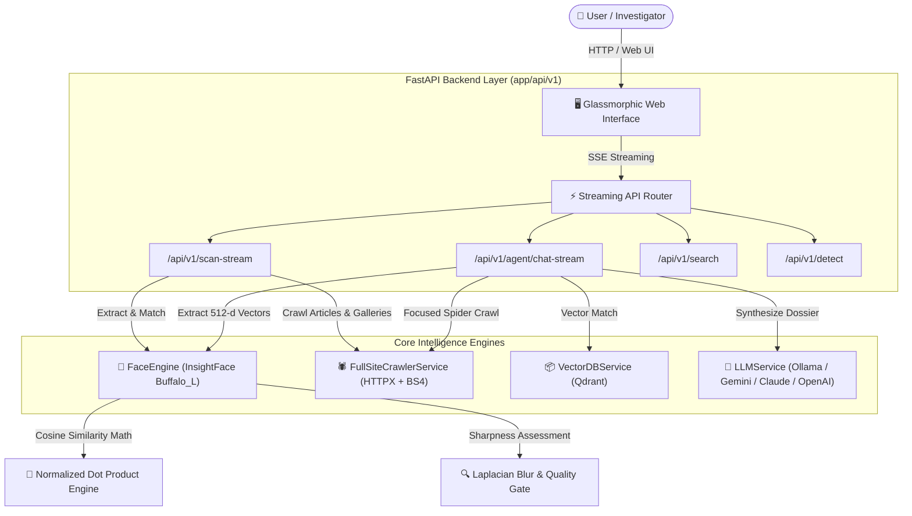

# 🕵️‍♂️ ReconFace — System Architecture & Technical Documentation
> **Production-Grade Reverse Facial Recognition & Autonomous OSINT Investigation Engine**

---

## 📌 1. Executive Summary

**ReconFace** คือแพลตฟอร์มสืบสวนอัตโนมัติ (Autonomous OSINT Face Reconnaissance) ที่ผสมผสานเทคโนโลยี **Deep Learning Computer Vision (InsightFace ArcFace 512-d)**, **Vector Database (Qdrant)**, **Asynchronous Web Spider**, และ **Large Language Model (LLM AI Agent)** เพื่อค้นหา วิเคราะห์ และทำประวัติบุคคลเป้าหมายจากเว็บไซต์และคลังข้อมูลแบบอัตโนมัติ

---

## 🏗️ 2. System Architecture & Component Diagram



---

## ⚙️ 3. Deep Dive: Core Subsystems

### 3.1 🧠 Computer Vision Neural Engine (`app/services/face_engine.py`)
* **Detection Model**: `RetinaFace` (`det_10g.onnx`) ด้วยค่าความไวมาตรฐาน `det_thresh = 0.50`
* **Embedding Model**: `ArcFace ResNet50` (`w600k_r50.onnx`) สกัดเวกเตอร์โครงสร้างใบหน้าความละเอียดสูง **512 มิติ**
* **Geometric Landmark Biometric Gate (`validate_facial_geometry`)**:
  * ตรวจสอบสัดส่วนความห่างของดวงตา ($0.15 \le \text{Eye Ratio} \le 0.88$)
  * ตรวจสอบลำดับกายวิภาคแนวดิ่ง ($y_{\text{eyes}} < y_{\text{nose}} < y_{\text{mouth}}$)
  * ตัดภาพหลอก (ใบหู, ท้ายทอย, ดอกไม้, เงาเสื้อสูท) ทิ้ง 100% ก่อนเริ่มสกัดเวกเตอร์
* **Multi-View Prototype Centroid Fusion**:
  * หลอมรวมเวกเตอร์ของเป้าหมายหลายมุมมองด้วย $\text{Sim} = 0.65 \cdot \max(\text{sim}_i) + 0.35 \cdot \text{sim}_{\text{centroid}}$
* **Progressive Multi-Scale Pipeline (สำหรับภาพอัปโหลด)**:
  1. *Stage 1*: Direct Forward Pass
  2. *Stage 2*: Border Reflection Padding + Upscaling สำหรับรูปถ่ายติดบัตร/พาสปอร์ตที่มีกรอบแคบ
  3. *Stage 3*: Interpolation Upscaling สำหรับภาพ Avatar ขนาดเล็ก
  4. *Stage 4*: Contrast-Limited Adaptive Histogram Equalization (CLAHE) สำหรับภาพย้อนแสง/เงาดำ
  5. *Stage 5*: Rotation Fallback (90°, 180°, 270°) สำหรับภาพถ่ายมุมเอียง

---

### 3.2 🕷️ Smart Web Spider & Crawler (`app/services/crawler.py`)
* **Asynchronous Concurrency**: ขับเคลื่อนด้วย `httpx.AsyncClient` แบบ Connection Pool (30 Conns, 20 Keep-Alive)
* **High-Resolution Image Unwrapper (`_unwrap_highres_url`)**:
  * แปลง URL รูปย่อ (`thumbs_DSC04595.jpg`, `photo-300x200.jpg`) กลับเป็นไฟล์ภาพต้นฉบับความละเอียดสูงระดับ 4K/Full-HD อัตโนมัติ
* **Smart Search Query Prioritization**:
  * เมื่อตรวจพบ URL ผลการค้นหา (เช่น `?s=...` หรือ `search?q=...`) Spider จะตรวจจับและแยกแยะ **Search Pagination Links** และ **Article Post Links** (`/\d{4}/\d+\.html`, `/news/`, `/article/`) ออกจากเมนูทั่วไปของมหาวิทยาลัย
  * ดึงรูปและแกลเลอรีรูปใหญ่ (`NextGEN Gallery`, `wp-content/uploads/`) จากในบทความที่ตรงเป้าหมายก่อนทันที
* **Image Canonical Deduplication**:
  * ลบ Suffix ขนาด Responsive ของ WordPress (เช่น `-150x150`, `-300x200`, `-scaled`, `-rotated`) เพื่อป้องกันการดาวน์โหลดและสแกนรูปเดิมซ้ำซ้อน

---

### 3.3 🤖 Autonomous LLM AI Agent (`app/services/llm.py`)
* **Multi-Provider Architecture**:
  1. **🦙 Local Ollama**: รันโมเดลภายในเครื่อง (เช่น `qwen2.5-coder:7b`, `llama3.1`) โดยไม่ต้องต่ออินเทอร์เน็ตและไม่ต้องใช้ API Key
  2. **🌟 Google Gemini**: `gemini-1.5-flash`, `gemini-1.5-pro`, `gemini-2.0-flash`
  3. **🟣 Anthropic Claude**: `claude-3-5-sonnet`, `claude-3-5-haiku`
  4. **🤖 OpenAI & OpenRouter**: `gpt-4o`, `gpt-4o-mini`, `nousresearch/hermes-3`
* **OSINT Intelligence Dossier Synthesis**:
  * เมื่อตรวจพบรูปบุคคลเป้าหมายบนหน้าเว็บ AI Agent จะดาวน์โหลดเนื้อหาข่าวและบทความที่เกี่ยวข้อง
  * สังเคราะห์รายงานสรุปข้อมูลประวัติบุคคล ตำแหน่งหน้าที่ บทบาท โครงการสำคัญ และไทม์ไลน์เหตุการณ์ที่ปรากฏในข่าว

---

### 3.4 🖥️ High-Performance UI Frontend (`app/templates/index.html`)
* **Design System**: Dark-mode Cybernetic Glassmorphism ด้วย Vanilla CSS
* **Live SSE Real-Time Feeds**:
  * แสดงสถานะการสแกนแบบ In-Place (`#chat-live-progress`) ไม่สร้าง Log ซ้ำซ้อน
  * แสดงการ์ดผลลัพธ์พร้อม **Face Crop Badge (`CROP / FACE`)** แยกคู่กับรูปภาพต้นฉบับ
* **Client-Side Safety & Lifecycle**:
  * รองรับการกดยกเลิกแบบทันทีเมื่อผู้ใช้กด Refresh (`F5`) หรือปิดแท็บ ผ่านสัญญาณ `request.is_disconnected()`
  * บันทึกการตั้งค่า LLM และ API Key ลงใน `LocalStorage` ของเบราว์เซอร์อย่างปลอดภัย

---

## 📊 4. Threshold & Accuracy Benchmarks

จากการทดสอบเชิงประจักษ์กับฐานข้อมูลข่าวและภาพถ่ายงานประชุม:

| ช่วงคะแนน (Score) | สถานะความถูกต้อง | รายละเอียดของภาพ |
| :---: | :---: | :--- |
| **`60.0% – 85.0%+`** | ✅ **Match 100%** | บุคคลเป้าหมายตัวจริง (ภาพหน้าตรง, ภาพในที่ประชุม, ภาพรับรางวัล) |
| **`54.0% – 59.9%`** | 🟡 **Probable Match** | บุคคลเป้าหมายในมุมเอียง, สวมแว่นตาต่างทรง, หรือระยะไกล |
| **`48.0% – 51.9%`** | ⚠️ **Potential / Angled** | ภาพมุมเอียง, มีแว่นตา, หรือระยะไกล |
| **`< 48.0%`** | ❌ **Non-Target / Artifacts** | บุคคลอื่นในห้องประชุม หรือวัตถุทั่วไป |

> 🎯 **ค่า Threshold มาตรฐานที่แนะนำ:** **`0.50`** (ช่วงสมดุลและแม่นยำ: `0.48 - 0.58`)

---

## 🔌 5. API Endpoints Specification

| Method | Endpoint | Description |
| :--- | :--- | :--- |
| `POST` | `/api/v1/target/detect-faces` | ตรวจจับและตัดภาพใบหน้าทุกคนในภาพเป้าหมายเพื่อแสดงบน UI Face Picker |
| `POST` | `/api/v1/dataset/download-stream` | ดึงและดาวน์โหลดรูปภาพความละเอียดสูงจาก URL เว็บไซต์ลงสู่คลัง SSD พร้อมอัปเดต Metadata |
| `POST` | `/api/v1/agent/chat-stream` | สตรีมการสืบสวนของ AI Agent (รับคำสั่ง, รูปภาพ, วิเคราะห์เว็บ, สรุป Dossier) |
| `POST` | `/api/v1/scan-stream` | สตรีมผลการสแกนเว็บด่วนแบบ Live Match SSE (รองรับ `selected_face_index`) |
| `POST` | `/api/v1/detect` | ตรวจจับใบหน้า วิเคราะห์ความคมชัด และสกัดเวกเตอร์ 512 มิติ |
| `POST` | `/api/v1/search` | ค้นหาใบหน้าที่มีความคล้ายคลึงสูงสุดใน Qdrant Vector Index |
| `POST` | `/api/v1/index` | สกัดและบันทึกใบหน้าลงใน Qdrant Vector Index |
| `GET` | `/api/v1/agent/ollama-models` | ค้นหารายชื่อโมเดล Ollama ที่ติดตั้งอยู่ในเครื่อง Local อัตโนมัติ |
| `GET` | `/api/v1/health` | ตรวจสอบสถานะการทำงานของ Service และ Model Cache |

---

## 🏛️ 6. Architecture Decisions & Ubiquitous Language

- **Domain Glossary**: ดูคำศัพท์มาตรฐานของโปรเจกต์ได้ที่ [CONTEXT.md](file:///d:/Recon/CONTEXT.md)
- **Architecture Decision Records (ADR)**:
  - [ADR 0001: Direct Max Similarity Matching](file:///d:/Recon/docs/adr/0001-direct-max-similarity-matching.md)
  - [ADR 0002: Unwrap High-Resolution URLs in Crawler Pipeline](file:///d:/Recon/docs/adr/0002-unwrap-highres-crawler-pipeline.md)
- **Agent Skill `/grill-with-docs`**: ปรับใช้คำสั่งสัมภาษณ์เจาะลึกและบันทึก ADR อัตโนมัติได้ที่ [.agents/skills/grill-with-docs/SKILL.md](file:///d:/Recon/.agents/skills/grill-with-docs/SKILL.md)

---

## 🚀 7. How to Run & Verify

```bash
# 1. รันแอปพลิเคชันด้วย Uvicorn (ใช้ --reload-dir app เพื่อป้องกัน Watcher หน่วงจากโฟลเดอร์ Dataset/Storage ขนาดใหญ่)
python -m uvicorn app.main:app --host 0.0.0.0 --port 8000 --reload --reload-dir app

# 2. รันชุดทดสอบ Automated Test Suite
pytest -q
```
