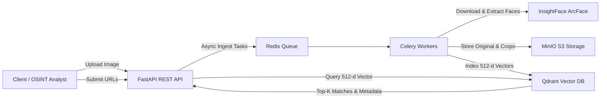

# 🎯 ReconFace: Production-Ready Reverse Face Recognition & Search

An end-to-end, distributed OSINT system designed to ingest images from web sources, extract 512-dimensional normalized face embeddings using **InsightFace ArcFace**, index vectors into **Qdrant Vector DB** using HNSW index and Cosine distance, and provide a fast REST API for reverse face searching.

---

## 🏗️ Architecture



---

## ⚡ Quickstart

### 1. Run via Docker Compose
```bash
docker compose up -d --build
```
Interactive Swagger API documentation: [http://localhost:8000/docs](http://localhost:8000/docs)  
Web Search & AI Recon UI: [http://localhost:8000/ui](http://localhost:8000/ui)

### 2. Hardware Acceleration & Cross-Platform Setup

ReconFace supports automatic hardware acceleration across platforms:
- **Windows / Linux (NVIDIA GPU)**: Uses CUDA (`CUDAExecutionProvider`) or DirectML (`DmlExecutionProvider`).
- **macOS (Apple Silicon M1/M2/M3/M4)**: Uses Apple Neural Engine / GPU (`CoreMLExecutionProvider`) or ARM64 high-performance CPU.

#### 🍏 macOS Setup (Recommended Hybrid Setup)
Docker Desktop on macOS cannot pass Apple GPU/Metal directly into Linux containers. For maximum performance on Mac, run databases in Docker and the AI engine natively:

```bash
# 1. Start Qdrant, Redis, and MinIO in Docker
docker compose up -d qdrant redis minio

# 2. Install Xcode command line tools & cmake (required for InsightFace build)
xcode-select --install
brew install cmake

# 3. Create virtual environment & install ReconFace
python3 -m venv .venv
source .venv/bin/activate
pip install -e ".[dev]"

# 4. Start API Server
uvicorn app.main:app --host 0.0.0.0 --port 8000 --reload
```

#### 🪟 Windows / Linux with NVIDIA GPU
```bash
pip install -e ".[dev,gpu]"
uvicorn app.main:app --host 0.0.0.0 --port 8000 --reload
```

---

## 📡 API Endpoints

### 1. Reverse Face Search
- **Endpoint**: `POST /api/v1/search`
- **Content-Type**: `multipart/form-data`
- **Params**:
  - `file`: Image file (JPG/PNG/WEBP)
  - `face_index`: Target face index (default: `0` = largest face)
  - `top_k`: Number of matches (default: `10`)
  - `score_threshold`: Cosine similarity cutoff (default: `0.6`)

### 2. URL Ingestion
- **Endpoint**: `POST /api/v1/ingest`
- **Body**:
  ```json
  {
    "url": "https://target-source.org/photo.jpg",
    "metadata": {
      "case_id": "OSINT-2026-001",
      "source": "web_archive"
    }
  }
  ```

### 3. Health Check
- **Endpoint**: `GET /api/v1/health`
- Returns status of API, Qdrant Vector DB collection, and Storage backend.

---

## 🧪 Testing
```bash
pytest tests/ -v
```
All unit and integration tests run with an in-memory instance of Qdrant and synthetic test image fixtures.
